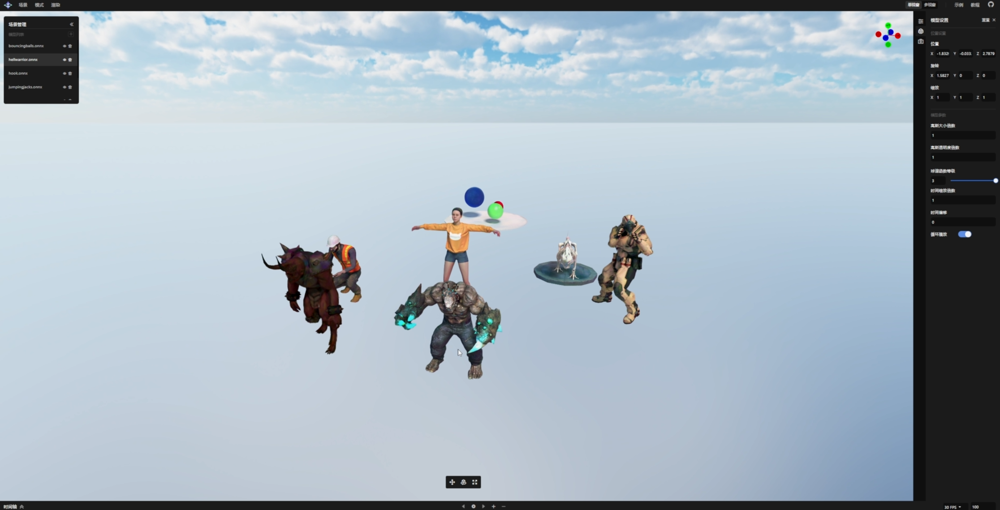
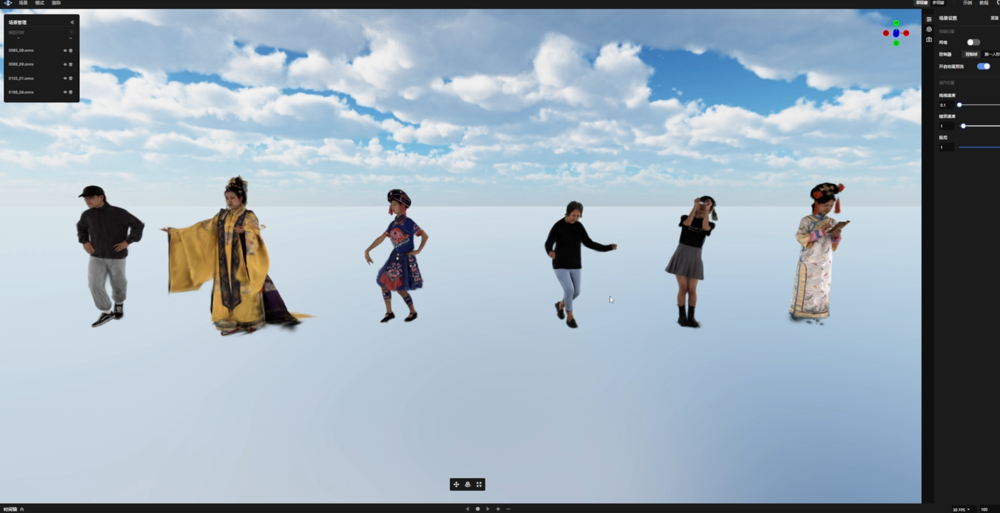

# Visionary

<div align="center">


[](LICENSE)
[](https://www.w3.org/TR/webgpu/)
[](https://www.typescriptlang.org/)

[English](README.md) | [中文](README-zh.md)

<h1 style="font-size:32px; margin: 6px 0 4px 0;">Visionary：面向下一代"大世界模型"的web渲染引擎</h1>
<p style="margin: 0 0 12px 0; font-size: 14px;">上海人工智能实验室 · 四川大学 · 东京大学 · 上海交通大学 · 西北工业大学</p>

[项目主页](https://visionary-laboratory.github.io/visionary/) | [论文](https://arxiv.org/abs/2512.08478) | [视频](https://youtu.be/-K8EjMfk09c) | [WebGPU常见问题](https://github.com/Visionary-Laboratory/visionary/issues/1) | [文档](https://ai4sports.opengvlab.com/help/zh/index.html)
</div>

---

> **TL;DR:** Visionary 是一个基于 WebGPU 和 ONNX Runtime 构建的开放、原生 Web 平台，支持在浏览器中实时渲染多种 Gaussian Splatting 变体（3DGS、MLP-based 3DGS、4DGS、Neural Avatars 以及 <span style="font-family: 'Brush Script MT', cursive; font-size: 1.2em; color: #FFD700; text-shadow: 1px 1px 2px black;">✨任何未来的算法✨</span>），并可直接渲染传统 3D Mesh；同时支持使用前馈网络进行后处理。

<details>
<summary><b>Abstract</b></summary>
神经渲染，特别是 3D Gaussian Splatting (3DGS)，发展迅速并已成为构建世界模型的关键组件。在这项工作中，我们推出了 Visionary，一个开放的原生 Web 平台，用于实时渲染各种 Gaussian Splatting 和网格。Visionary 基于高效的 WebGPU 渲染器和逐帧 ONNX 推理构建，能够在保持轻量级、"点击即运行"的浏览器体验的同时，实现动态神经处理。它引入了标准化的 Gaussian Generator 契约，不仅支持标准 3DGS 渲染，还允许即插即用的算法在每帧生成或更新高斯体。这种推理能力也使我们能够应用前馈生成式后处理。该平台进一步提供了一个插件式的 three.js 库，并具有简洁的 TypeScript API，可无缝集成到现有的 Web 应用程序中。实验表明，在相同的 3DGS 资产下，由于基于 GPU 的图元排序，Visionary 实现了优于当前 Web 查看器的渲染效率。它已经支持多种变体，包括基于 MLP 的 3DGS、4DGS、神经 Avatar 以及风格迁移或增强网络。通过直接在浏览器中统一推理和渲染，Visionary 显著降低了 3DGS 系列方法的复现、比较和部署门槛，作为一个统一的世界模型引擎，服务于重建和生成范式。
</details>

我们基于 Visionary 开发了一个功能强大的 [在线编辑器](https://visionary-laboratory.github.io/visionary/index_visionary.html)，帮助用户一键轻松管理和编辑 3D 场景。如果想用本项目开发自己的 Web 项目，请参考 [快速开始](#quick-start)。

https://github.com/user-attachments/assets/6824de84-e4db-4c3f-90e8-1061ff309579

## ✨ 项目特色

- **🚀 原生 WebGPU 驱动**：利用 `webgpu` 实现百万级高斯粒子的高性能并行排序与渲染。
- **🎨 混合渲染架构**：自动处理高斯点云与标准 Mesh 的深度混合（Depth Compositing），完美解决遮挡问题，支持复杂的场景组合。
- **📦 统一资源加载 (Universal Loader)**：单一接口智能识别并加载多种格式：
  - **静态高斯**: PLY, SPLAT, KSplat, SPZ, SOG
  - **标准模型**: GLB, GLTF, FBX, OBJ
  - **4DGS/Avatar/scaffold-GS**: ONNX
  - **<span style="font-family: 'Brush Script MT', cursive; font-size: 1.1em; color: #FF4500;">🔥自定义算法</span>**: 详见 [导出算法至 ONNX](onnx-export/README.md)。


## WebGPU 环境要求与已知问题

- **浏览器：** 需要较新的 Chrome（或其他基于 Chromium 的浏览器），并开启 WebGPU。
- **推荐平台：** 推荐使用 Windows 10/11 + **独立显卡**（NVIDIA / AMD），以获得相对稳定的性能。
- **Ubuntu：** 目前由于 Chrome 在 Ubuntu 上的 WebGPU 存在 bug，导致 fp16 不受支持，本项目的 fp16 ONNX 流水线无法正常运行，**暂不支持 Ubuntu**，需要等待官方修复后再开启支持。
- **macOS：** 大多数 Mac 的 GPU 性能有限，不适合重负载的 3D Gaussian Splatting。除非使用 M4 Max 等高端芯片，否则**不推荐**作为主要运行环境，实际体验可能会非常卡顿。


<a id="quick-start"></a>
<a id="快速开始"></a>
## 🚀 快速开始

### 1. 安装依赖

确保您的环境中已安装 [Node.js](https://nodejs.org/) (推荐 v18+)。

```bash
# 克隆仓库
git clone https://github.com/Visionary-Laboratory/visionary.git
cd visionary

# 安装依赖
npm install
```

### 2. 启动开发服务器

```bash
npm run dev
```

启动成功后，访问以下地址查看示例：
👉 **http://localhost:3000/demo/simple/index.html**

其他示例详见[demo](/demo/).

### 3. 模型资产


可以在页面中导入我们提供的示例资产[ (1)](https://drive.google.com/drive/folders/1nk5slXl-_-jRyDggXoBpRwz2VajmQizQ?usp=drive_link)[ (2)](https://drive.google.com/file/d/1qRYffgZxNyiJrh9mwwjEOr3uoxcbll0Q/view?usp=share_link)[ (3)](https://drive.google.com/file/d/1F4XGS1W4c3Kc13n4YaoDNxnWZqOfvlBJ/view?usp=share_link)，也可以在页面中导入自己的 3DGS/4DGS/Avatar 资产。4DGS/Avatar/自定义资产的制作详见[转化 ONNX](#convert-to-onnx)。

<a id="convert-to-onnx"></a>
<a id="导出算法至-onnx"></a>
## 🛠️ 导出算法至 ONNX

本项目支持渲染多种 3DGS/4DGS/Avatar/自定义表示。要做到这一点，需要将训练好的 3D 表示导出为 ONNX 格式。本项目提供了 4DGS/Dynamic Avatar/Scaffold-GS 的转换示例，详见[导出指南](onnx-export/README.md)。

## 🤝 贡献与致谢

本项目深受以下开源项目的启发与支持，特此致谢：

- **[3D Gaussian Splatting](https://repo-sam.inria.fr/fungraph/3d-gaussian-splatting/)**
- **[Three.js](https://threejs.org/)**
- **[ONNX Runtime Web](https://onnxruntime.ai/)**
- **[web-splat](https://github.com/KeKsBoTer/web-splat/)**
- **[image-to-line-drawing](https://github.com/luckycucu/image-to-line-drawing/)**

## 📄 引用 (Citation)

如果您在研究或项目中使用了 Visionary，请考虑引用：

```bibtex
@article{gong2025visionary,
      title={Visionary: The World Model Carrier Built on WebGPU-Powered Gaussian Splatting Platform}, 
      author={Gong, Yuning and Liu, Yifei and Zhan, Yifan and Niu, Muyao and Li, Xueying and Liao, Yuanjun and Chen, Jiaming and Gao, Yuanyuan and Chen, Jiaqi and Chen, Minming and Zhou, Li and Zhang, Yuning and Wang, Wei and Hou, Xiaoqing and Huang, Huaxi and Tang, Shixiang and Ma, Le and Zhang, Dingwen and Yang, Xue and Yan, Junchi and Zhang, Yanchi and Zheng, Yinqiang and Sun, Xiao and Zhong, Zhihang},
      journal={arXiv preprint arXiv:2512.08478},
      year={2025}
}
```

## 📝 License

本项目采用 [Apache-2.0 License](LICENSE) 许可证。
